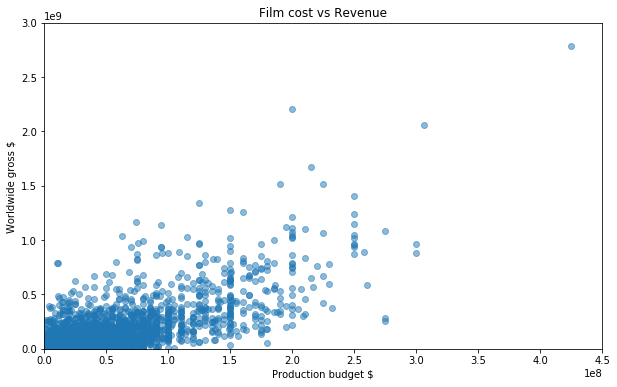
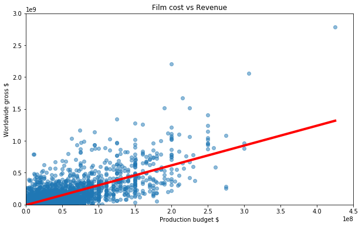

1. Question: Can we use movie budget to predict movie revenue?\
Data source: https://www.the-numbers.com/movie/budgets

```python
import pandas as pd
import matplotlib.pyplot as plt
from sklearn.linear_model import LinearRegression
```


```python
#Gathering and cleaning data

data = pd.read_csv("cost_revenue_clean.csv")
data
```


<div>
<style scoped>
    .dataframe tbody tr th:only-of-type {
        vertical-align: middle;
    }

    .dataframe tbody tr th {
        vertical-align: top;
    }

    .dataframe thead th {
        text-align: right;
    }
</style>
<table border="1" class="dataframe">
  <thead>
    <tr style="text-align: right;">
      <th></th>
      <th>production_budget_usd</th>
      <th>worldwide_gross_usd</th>
    </tr>
  </thead>
  <tbody>
    <tr>
      <th>0</th>
      <td>1000000</td>
      <td>26</td>
    </tr>
    <tr>
      <th>1</th>
      <td>10000</td>
      <td>401</td>
    </tr>
    <tr>
      <th>2</th>
      <td>400000</td>
      <td>423</td>
    </tr>
    <tr>
      <th>3</th>
      <td>750000</td>
      <td>450</td>
    </tr>
    <tr>
      <th>4</th>
      <td>10000</td>
      <td>527</td>
    </tr>
    <tr>
      <th>...</th>
      <td>...</td>
      <td>...</td>
    </tr>
    <tr>
      <th>5029</th>
      <td>225000000</td>
      <td>1519479547</td>
    </tr>
    <tr>
      <th>5030</th>
      <td>215000000</td>
      <td>1671640593</td>
    </tr>
    <tr>
      <th>5031</th>
      <td>306000000</td>
      <td>2058662225</td>
    </tr>
    <tr>
      <th>5032</th>
      <td>200000000</td>
      <td>2207615668</td>
    </tr>
    <tr>
      <th>5033</th>
      <td>425000000</td>
      <td>2783918982</td>
    </tr>
  </tbody>
</table>
<p>5034 rows × 2 columns</p>
</div>


```python
data.describe()
```


<div>
<style scoped>
    .dataframe tbody tr th:only-of-type {
        vertical-align: middle;
    }

    .dataframe tbody tr th {
        vertical-align: top;
    }

    .dataframe thead th {
        text-align: right;
    }
</style>
<table border="1" class="dataframe">
  <thead>
    <tr style="text-align: right;">
      <th></th>
      <th>production_budget_usd</th>
      <th>worldwide_gross_usd</th>
    </tr>
  </thead>
  <tbody>
    <tr>
      <th>count</th>
      <td>5.034000e+03</td>
      <td>5.034000e+03</td>
    </tr>
    <tr>
      <th>mean</th>
      <td>3.290784e+07</td>
      <td>9.515685e+07</td>
    </tr>
    <tr>
      <th>std</th>
      <td>4.112589e+07</td>
      <td>1.726012e+08</td>
    </tr>
    <tr>
      <th>min</th>
      <td>1.100000e+03</td>
      <td>2.600000e+01</td>
    </tr>
    <tr>
      <th>25%</th>
      <td>6.000000e+06</td>
      <td>7.000000e+06</td>
    </tr>
    <tr>
      <th>50%</th>
      <td>1.900000e+07</td>
      <td>3.296202e+07</td>
    </tr>
    <tr>
      <th>75%</th>
      <td>4.200000e+07</td>
      <td>1.034471e+08</td>
    </tr>
    <tr>
      <th>max</th>
      <td>4.250000e+08</td>
      <td>2.783919e+09</td>
    </tr>
  </tbody>
</table>
</div>


```python
#Explore and visualization

x = pd.DataFrame(data, columns=["production_budget_usd"])
y = pd.DataFrame(data, columns=["worldwide_gross_usd"])
```


```python
plt.figure(figsize=(10,6))
plt.ylim(0, 3000000000) #no negative gross
plt.xlim(0, 450000000)#no negative budget
plt.scatter(x, y, alpha=0.5)
plt.title("Film cost vs Revenue")
plt.xlabel("Production budget $")
plt.ylabel("Worldwide gross $")
plt.show()
```





```python
#Most films were smaller production with budget< $1M
#Higher budget films appears indeed have more revenue, but how much higher exactly?
```


```python
regression = LinearRegression()
regression.fit(x, y) #run the regression
```


    LinearRegression(copy_X=True, fit_intercept=True, n_jobs=None, normalize=False)


```python
regression.coef_ #Slope coefficient
```


    array([[3.11150918]])


```python
regression.intercept_  #Intercept
```


    array([-7236192.72913963])


```python
#For each dolar, we gain $3USD
#For zero budget, we loose $7M USD
```


```python
plt.figure(figsize=(10,6))
plt.plot(x, regression.predict(x), color="red", linewidth=4) #object created for regression
plt.ylim(0, 3000000000) #no negative gross
plt.xlim(0, 450000000)#no negative budget
plt.scatter(x, y, alpha=0.5)
plt.title("Film cost vs Revenue")
plt.xlabel("Production budget $")
plt.ylabel("Worldwide gross $")
plt.show()
```





Evaluate:
1)There is a positive relationship between budget and revenue (3.1): for each dollar spend in producing the movie, we should get around three point one dollar-> higher budget films tend to do better\
2)A movie with a budget of 0, we will lose 7Millon dollars.\
3)This model seems to predict worse at the extremes\


```python
regression.score(x,y) #amount of revenue that is explain for the model
```


    0.5496485356985727


```python
#Our model can explain 55% of the variation that we see in worldwide movie earnings
```


```python

```
